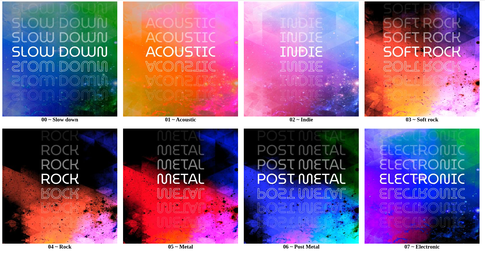

# Spotify playlist manager

Generate all my playlists cover and manage name + order with spotify API




## Install

``` npm i ```

Move ``` .env.dist ``` to ``` .env ``` and fill credentials

## Configuration

Go to src, and update files like you want

 - ``` index.html```: Your global template
 - ``` playlists.json```: Specific elements for each playlist

## Launch 

``` npm run start ```

## Preview

``` npm run preview```


